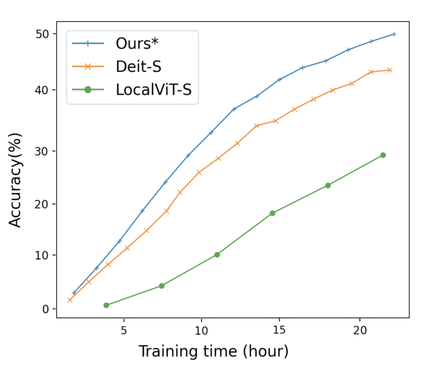
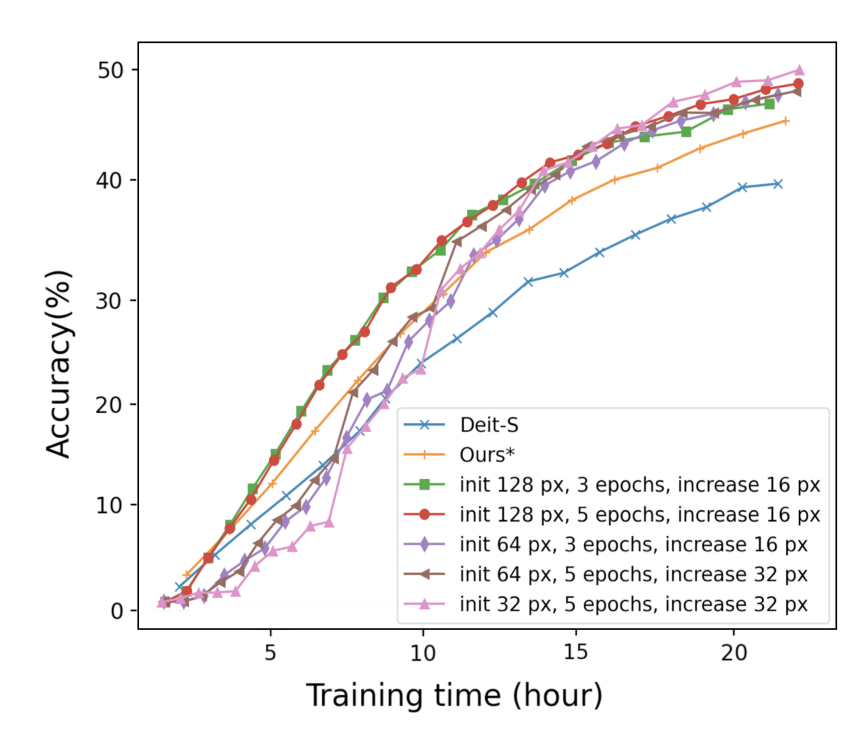

# Efficient VisionTransformer

This repository contains implementation for the paper [Training a Vision Transformer from scratch in less than 24 hours with 1 GPU](https://arxiv.org/abs/2211.05187) published in [HiTY](https://hity-workshop.github.io/NeurIPS2022/) workshop at Neurips 2022.

The implementation is a PyTorch evaluation code and training code based on [DeiT](https://github.com/facebookresearch/deit). We also use and edit some code from [LocalViT](https://github.com/ofsoundof/LocalViT), [Timm](https://github.com/huggingface/pytorch-image-models/tree/main/timm) and [torchvision](https://github.com/pytorch/vision/tree/main/torchvision).

In all experiments we build on DeiT-small model, and try to make the training more efficient time-wise (24 hours) and GPU-wise (1). This includes removing warm-up, an improved [LocalViT model](https://arxiv.org/abs/2104.05707), in addition to our own multi-size training. There's also the possibility to use [LayerScale](https://arxiv.org/pdf/2103.17239.pdf) in the code. 

Our Best results are as below:





Before using it, make sure you have the pytorch-image-models package [`timm==0.3.2`](https://github.com/rwightman/pytorch-image-models) by [Ross Wightman](https://github.com/rwightman) installed. 

# Usage

First, clone the repository locally:

Then, install PyTorch 1.7.0+ and torchvision 0.8.1+ and [pytorch-image-models 0.3.2](https://github.com/rwightman/pytorch-image-models):

```
conda install -c pytorch pytorch torchvision
pip install timm==0.3.2
```

## Data preparation

Download and extract ImageNet train and val images from http://image-net.org/.
The directory structure is the standard layout for the torchvision [`datasets.ImageFolder`](https://pytorch.org/docs/stable/torchvision/datasets.html#imagefolder), and the training and validation data is expected to be in the `train/` folder and `val` folder respectively:

```
/path/to/imagenet/
  train/
    class1/
      img1.jpeg
    class2/
      img2.jpeg
  val/
    class1/
      img3.jpeg
    class/2
      img4.jpeg
```

## Training

In all experiments with 1 GPU we use --batch-size 64 and --lr 1e-3. (If you want to experiment with 4 GPUs, use --batch-size 128 and --lr 2e-4)
We stop the training after 1 day.

To Train the network with the best config on 1 GPU, run varsize_1gpu_best.sh with your own paths. 

## Results

To plot the accuracy per time results, use plot_output.py with your own paths. 

## Cite

Please cite the paper if you use the idea or code.

@misc{irandoust2022training,
      title={Training a Vision Transformer from scratch in less than 24 hours with 1 GPU}, 
      author={Saghar Irandoust and Thibaut Durand and Yunduz Rakhmangulova and Wenjie Zi and Hossein Hajimirsadeghi},
      year={2022},
      eprint={2211.05187},
      archivePrefix={arXiv},
      primaryClass={cs.CV}
}


